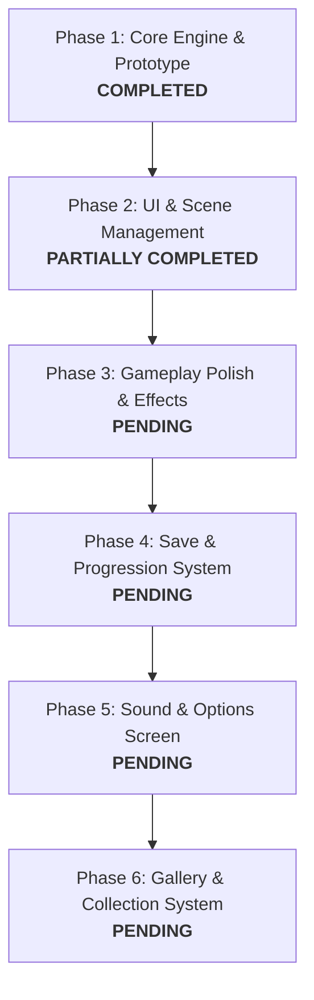

# Tasty Planet Fan Game - Project Roadmap & Plan

Welcome to the development roadmap! This document is designed to help you and your son work together efficiently on building and polishing your fan game. It outlines the current project status, immediate next steps, collaborative development roles, and a handy Phaser 3 reference guide.

---

## 🗺️ Project Roadmap



### Phase 1: Core Engine & Prototype (Completed ✅)
- WASD and Arrow key controls.
- Mouth-based consumption detection (hitbox moves dynamically with velocity).
- Player growth math (visual growth and internal progression tracking).
- Size tiers (1-5) and automatic camera zoom.
- Edible item spawning and hazard bounce physics.

### Phase 2: User Interface & Level Selector (Partially Completed 🟡)
- **Completed**:
  - Main Menu scene (basic).
  - World Select scene (7 worlds, World 1 unlocked).
  - Level Select grid scene (pulls levels from configuration).
  - Level Detail scene (shows star thresholds and play button).
  - End of Level Scene (displays time, score, stars).
- **Remaining**:
  - Implement actual World/Level progression restrictions (making locked worlds/levels unplayable).
  - Visualizing earned stars in the Level Select grid.
  - Interactive Options, Gallery, and Quit buttons on the Main Menu.

### Phase 3: Gameplay Polish & Effects (Pending ⏳)
- Add visual indicators for hazard danger (e.g., hazard warnings when they are offscreen but close).
- Particle effects (e.g., smoke or crumbs when the player consumes an item, camera shake on hazard collision).
- Sophisticated hazard behaviors (e.g., patrolling along paths, or emitting projectile hazards like crumbs/bubbles).

### Phase 4: Save & Progression System (Pending ⏳)
- Implement a `localStorage` save manager to persist:
  - Unlocked worlds and levels.
  - High scores and stars earned per level.
  - Gallery records of consumed items.

### Phase 5: Sound & Options Screen (Pending ⏳)
- Add background music and sound effects (eating sounds, hit penalties, level completion fanfares).
- Implement Options scene with audio controls (Sound FX On/Off, Music On/Off).

### Phase 6: Gallery & Collection System (Pending ⏳)
- Implement the Gallery scene to view cards/renders of all items eaten, showing the counts consumed.

---

## 👥 Collaborative Roles (Father & Son)

Working together is the best part! Here is a recommended breakdown of activities where you can team up:

### 🎨 The Son (Game Designer & Artist)
* **Visuals & Art**: Draw new sprite images (PNG format) for player skins, new edible items, or hazards. Put them in [assets/images/](file:///home/alanebarber3/ptt/ptt/assets/images).
* **Level Configuration**: Design level layouts! Open [js/config.js](file:///home/alanebarber3/ptt/ptt/js/config.js) and add new items, adjust their sizes, change colors, or set how many spawn in a tier.
* **Testing & Tuning**: Playtest the game to see if it is too hard or too easy. Adjust the player speed or growth factor in the config file.
* **Audio Curator**: Hunt for free, high-quality audio clips (wav/mp3) for eat sounds, damage sounds, and victory music.

### 💻 The Father / AI (Software Engineer)
* **Save/Load Logic**: Implement `localStorage` to save game state.
* **Complex Features**: Build the gallery layout, options toggles, and state transitions between scenes.
* **Physics & Math**: Program advanced hazard AI, coordinate systems, and projectiles.
* **Debugging & Writing Tests**: Keep the test suite passing by updating or writing new tests in [tests/](file:///home/alanebarber3/ptt/ptt/tests) when features are added.

---

## 🛠️ Step-by-Step Task List for Next Sessions

Here are some suggested bite-sized tasks to tackle next:

### Task 1: Complete the Pause Menu UI
- **Goal**: When pressing `ESC`, overlay a simple pause menu instead of just freezing the screen.
- **Action**: Add buttons to "Resume", "Restart Level", or "Exit to Menu" using Phaser UI text elements.
- **File to Edit**: [js/scenes/GameScene.js](file:///home/alanebarber3/ptt/ptt/js/scenes/GameScene.js) around line 307.

### Task 2: Implement Save Data persistence (`localStorage`)
- **Goal**: Remember high scores and unlocked levels when the browser is refreshed.
- **Action**: Create a helper class `SaveManager` that uses `localStorage.setItem()` and `localStorage.getItem()`.
- **Files to Edit/Create**: Create `js/utils/SaveManager.js` and link it in [index.html](file:///home/alanebarber3/ptt/ptt/index.html).

### Task 3: Visual Stars on Level Select
- **Goal**: Show 0-3 gold stars below each level circle in the selection screen.
- **Action**: Query the `SaveManager` for the level's high score/stars and draw tiny star graphics or text under the button.
- **File to Edit**: [js/scenes/LevelSelectScene.js](file:///home/alanebarber3/ptt/ptt/js/scenes/LevelSelectScene.js).

### Task 4: Add Sound Effects
- **Goal**: Make a satisfying "crunch" or "bubble" sound play when an item is eaten.
- **Action**: Load audio files in `preload()` (e.g., `this.load.audio('eatSound', 'assets/audio/crunch.mp3')`) and play them inside consumption events.
- **Files to Edit**: [js/scenes/GameScene.js](file:///home/alanebarber3/ptt/ptt/js/scenes/GameScene.js) and [index.html](file:///home/alanebarber3/ptt/ptt/index.html).

---

## 💡 Phaser 3 Quick Cheat Sheet

Here are common code patterns you might need to use as you build:

### 1. Scene Transitions
To change from the current scene to another:
```javascript
// Switches to LevelSelectScene and unloads the current one
this.scene.start('LevelSelectScene');

// Switches to LevelSelectScene and passes data to it
this.scene.start('LevelSelectScene', { unlockedLevel: 2 });
```

### 2. Playing a Sound
First, load it in `preload()`:
```javascript
this.load.audio('pop', 'assets/audio/pop.mp3');
```
Then, play it in `create()` or during gameplay events:
```javascript
this.sound.play('pop', { volume: 0.8 });
```

### 3. Adding an Image / Sprite
Load in `preload()`:
```javascript
this.load.image('apple', 'assets/images/apple.png');
```
Add to scene in `create()`:
```javascript
// Adds at coordinate X=400, Y=300
const item = this.add.image(400, 300, 'apple');
```

### 4. Making an Element Interactive
To make a button or sprite clickable:
```javascript
const btn = this.add.text(100, 100, 'CLICK ME', { fill: '#fff' });
btn.setInteractive({ useHandCursor: true });

// Mouse hover event
btn.on('pointerover', () => btn.setStyle({ fill: '#ff0' }));
// Mouse hover out event
btn.on('pointerout', () => btn.setStyle({ fill: '#fff' }));
// Mouse click event
btn.on('pointerdown', () => {
    console.log('Button clicked!');
});
```
